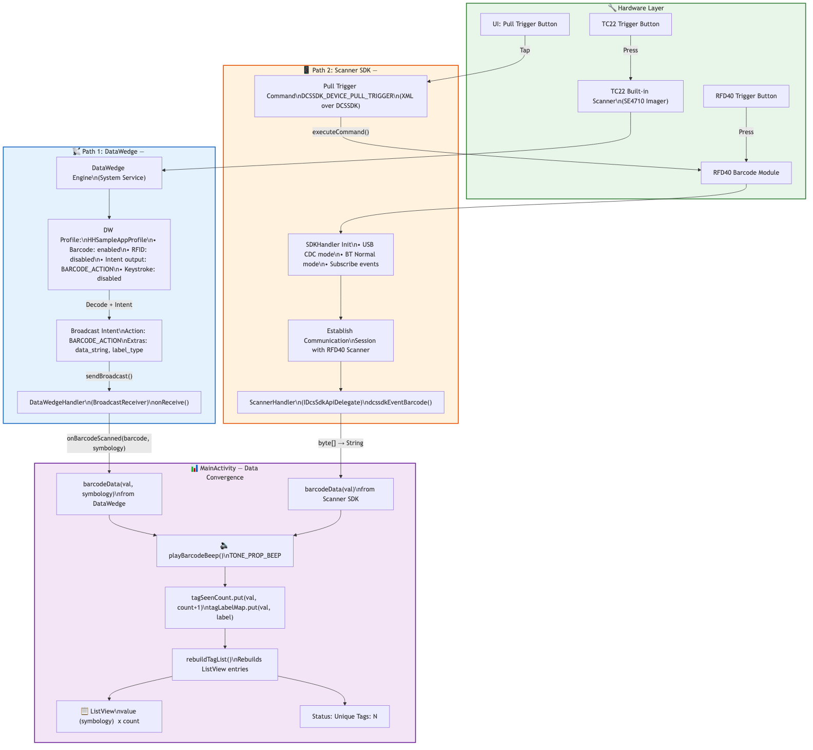

# Design Document: Barcode Capture Architecture

## Architecture Flowchart



## Overview

This application uses **two independent barcode capture paths** to handle scanning from different hardware:

| Path | Hardware | Scanner | SDK/API |
|------|----------|---------|---------|
| **Path 1** | TC22 built-in imager | Internal SE4710 | DataWedge Intent API |
| **Path 2** | RFD40 sled barcode engine | RFD40 barcode module | Zebra Scanner SDK (DCSSDK) |

Both paths ultimately deliver barcode data to `MainActivity` for display with seen-count tracking.

---

## Path 1: DataWedge → TC22 Internal Scanner

### How It Works

The TC22 has a built-in barcode scanner managed by **DataWedge**, a system service pre-installed on all Zebra Android devices. The app communicates with DataWedge entirely through **Broadcast Intents** — no direct scanner hardware access is needed.

### Sequence

```
TC22 Hardware Trigger / Soft Trigger
        │
        ▼
┌──────────────────┐
│   DataWedge       │  (System service on TC22)
│   Engine           │
│   - Decodes barcode│
│   - Applies profile│
└────────┬───────────┘
         │  Broadcast Intent
         │  Action: "com.zebra.rfid.demo.sdksample.BARCODE_ACTION"
         │  Extras: data_string, label_type
         ▼
┌──────────────────────────┐
│  DataWedgeHandler         │
│  BroadcastReceiver        │
│  .onReceive()             │
│   - Extracts barcode text │
│   - Extracts symbology    │
└────────┬─────────────────┘
         │  listener.onBarcodeScanned(barcode, symbology)
         ▼
┌──────────────────────────┐
│  MainActivity             │
│  .barcodeData(val, sym)   │
│   - Plays beep            │
│   - Updates seen count    │
│   - Refreshes ListView    │
│   - Shows Toast           │
└──────────────────────────┘
```

### Setup (performed in `onPostResume`)

1. **Register BroadcastReceiver** — `DataWedgeHandler.registerReceiver()` registers for three actions:
   - `NOTIFICATION_ACTION` — scanner status changes (WAITING, SCANNING, etc.)
   - `RESULT_ACTION` — profile creation results
   - `BARCODE_ACTION` — decoded barcode data (custom action for this app)

2. **Create/Update Profile** — `DataWedgeHandler.createProfile("HHSampleAppProfile")` sends a `SET_CONFIG` intent to DataWedge that:
   - Creates a profile named `HHSampleAppProfile` (or updates if it exists)
   - **Enables** the `BARCODE` plugin with `scanner_selection = auto`
   - **Disables** the `RFID` plugin (RFID is handled by the RFID SDK directly)
   - **Enables** `INTENT` output with action `BARCODE_ACTION` and delivery mode `Broadcast`
   - **Disables** `KEYSTROKE` output (prevents barcode text from injecting into text fields)
   - Associates the profile with this app's package name for all activities

3. **Register for Notifications** — `DataWedgeHandler.registerForNotifications()` subscribes to `SCANNER_STATUS` to monitor scanner state.

### Key Configuration Details

| Setting | Value | Why |
|---------|-------|-----|
| `scanner_selection` | `auto` | Lets DataWedge choose the best available scanner |
| `intent_delivery` | `2` (Broadcast) | App receives data even when not in foreground focus |
| `RECEIVER_EXPORTED` | Set on API 33+ | Required for cross-app broadcast from DataWedge |
| `rfid_input_enabled` | `false` | Prevents DataWedge from competing with RFID SDK |
| `keystroke_output_enabled` | `false` | Prevents barcode text injection into EditText fields |

### Data Flow

When DataWedge decodes a barcode, it sends a broadcast with:
- **`com.symbol.datawedge.data_string`** — the decoded barcode value (e.g., `"00041570058978"`)
- **`com.symbol.datawedge.label_type`** — the symbology (e.g., `"LABEL-TYPE-EAN128"`)

The `BroadcastReceiver` in `DataWedgeHandler` extracts these and calls `listener.onBarcodeScanned(barcode, symbology)`, which routes to `MainActivity.barcodeData(val, symbology)`.

---

## Path 2: Scanner SDK → RFD40 Barcode Engine

### How It Works

The RFD40 sled has its own barcode scanner separate from the TC22. This scanner is controlled through the **Zebra Scanner SDK (DCSSDK)**, which communicates over USB CDC or Bluetooth. The app establishes a communication session with the RFD40's scanner module after the RFID reader connects.

### Sequence

```
RFD40 Hardware Trigger (Bottom button) / Software Pull Trigger
        │
        ▼
┌──────────────────────────┐
│  RFD40 Scanner Module     │
│  - Decodes barcode        │
│  - Sends via USB/BT       │
└────────┬─────────────────┘
         │  DCSSDK callback
         ▼
┌──────────────────────────┐
│  ScannerHandler           │
│  (IDcsSdkApiDelegate)     │
│  .dcssdkEventBarcode()    │
│   - Converts byte[] → String │
└────────┬─────────────────┘
         │  context.barcodeData(s)
         ▼
┌──────────────────────────┐
│  MainActivity             │
│  .barcodeData(val)        │
│   - Plays beep            │
│   - Updates seen count    │
│   - Refreshes ListView    │
│   - Shows Toast           │
└──────────────────────────┘
```

### Setup (performed after RFID reader connects)

The Scanner SDK is initialized inside `RFIDHandler.setupScannerSDK()`, which runs after a successful RFID reader connection:

1. **Create SDKHandler** — `new SDKHandler(context)` initializes the Zebra Scanner SDK.

2. **Set Operational Modes** — Two modes are configured:
   - `DCSSDK_OPMODE_USB_CDC` — for USB-attached RFD40
   - `DCSSDK_OPMODE_BT_NORMAL` — for Bluetooth-paired RFD40

3. **Set Delegate** — `sdkHandler.dcssdkSetDelegate(scannerHandler)` routes all scanner events to `ScannerHandler`.

4. **Subscribe to Events** — The app subscribes to:
   - `DCSSDK_EVENT_SCANNER_APPEARANCE` — scanner detected
   - `DCSSDK_EVENT_SCANNER_DISAPPEARANCE` — scanner lost
   - `DCSSDK_EVENT_BARCODE` — barcode decoded
   - `DCSSDK_EVENT_SESSION_ESTABLISHMENT` — communication session opened
   - `DCSSDK_EVENT_SESSION_TERMINATION` — communication session closed

5. **Establish Session** — The app enumerates available scanners, matches one to the connected RFID reader hostname, and calls `dcssdkEstablishCommunicationSession(scannerID)` to open the link.

### Software Trigger (Pull Trigger Button)

When the user taps the "Pull Trigger" button in the UI:

```
MainActivity.scanCode()
       │
       ▼
RFIDHandler.scanCode()
       │  Builds XML: <inArgs><scannerID>{id}</scannerID></inArgs>
       ▼
sdkHandler.dcssdkExecuteCommandOpCodeInXMLForScanner(
    DCSSDK_DEVICE_PULL_TRIGGER, xml, outXML, scannerID)
       │
       ▼
RFD40 scanner activates → decodes → dcssdkEventBarcode callback
```

### ScannerHandler Callbacks

| Callback | Purpose |
|----------|---------|
| `dcssdkEventScannerAppeared` | Logs scanner detection |
| `dcssdkEventScannerDisappeared` | Disables scan button |
| `dcssdkEventCommunicationSessionEstablished` | Enables scan button, shows Toast |
| `dcssdkEventCommunicationSessionTerminated` | Disables scan button |
| `dcssdkEventBarcode` | Converts `byte[]` → `String`, calls `MainActivity.barcodeData(s)` |

---

## Comparison of Both Paths

| Aspect | DataWedge (TC22) | Scanner SDK (RFD40) |
|--------|------------------|---------------------|
| **Trigger** | TC22 hardware button or DataWedge soft trigger | RFD40 bottom trigger or "Pull Trigger" UI button |
| **Communication** | Broadcast Intents | DCSSDK callbacks (USB CDC / Bluetooth) |
| **Setup** | Profile creation via Intent API | SDKHandler + session establishment |
| **Symbology** | Provided as `label_type` extra | Not provided (raw barcode only) |
| **Lifecycle** | Register/unregister in `onPostResume`/`onPause` | Initialized after RFID connect, torn down on disconnect |
| **Dependencies** | DataWedge (pre-installed) | `BarcodeScannerLibrary.aar` |
| **Entry Point** | `DataWedgeHandler.onReceive()` | `ScannerHandler.dcssdkEventBarcode()` |
| **Data Destination** | `barcodeData(val, symbology)` | `barcodeData(val)` |

---

## Data Convergence in MainActivity

Both paths converge in `MainActivity`:

```
DataWedge Path ──→ barcodeData(val, symbology)──┐
                                                  ├──→ playBarcodeBeep()
Scanner SDK Path ──→ barcodeData(val) ───────────┘    tagSeenCount.put(val, count+1)
                                                       rebuildTagList()
                                                       updateUniqueTagCount()
```

- **Seen count** is tracked per barcode value in `tagSeenCount` (LinkedHashMap)
- **Display label** is stored in `tagLabelMap` (symbology for DW, "Barcode" for SDK)
- **UI list** shows: `{barcode_value} ({label})  x{count}`
- **Beep** plays once per scan for confirmation

---

## Lifecycle Summary

```
onCreate
  ├── Initialize DataWedgeHandler
  └── Initialize RFIDHandler → initSDK → connectReader
                                              │
onPostResume                                  ▼
  ├── DataWedge: registerReceiver      RFID connect success
  ├── DataWedge: createProfile           └── setupScannerSDK()
  └── DataWedge: registerForNotifications    └── Establish scanner session
                                                  └── Scan button enabled
onPause
  ├── DataWedge: unregisterReceiver
  └── RFID: disconnect → terminate scanner session

onDestroy
  └── RFID: dispose → shutdown executor
```
